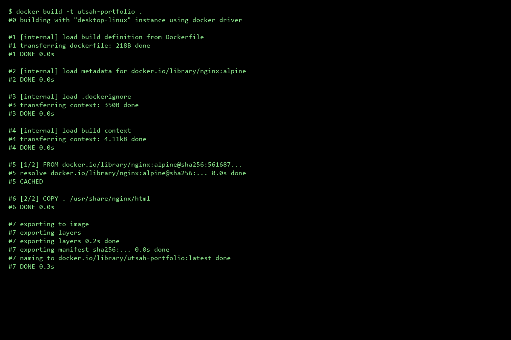
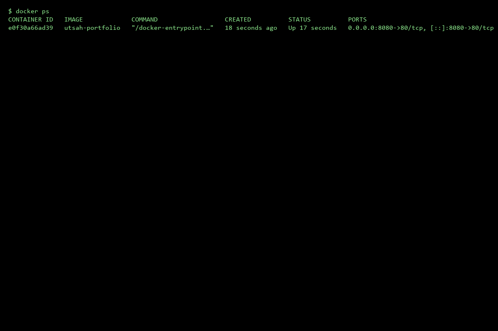
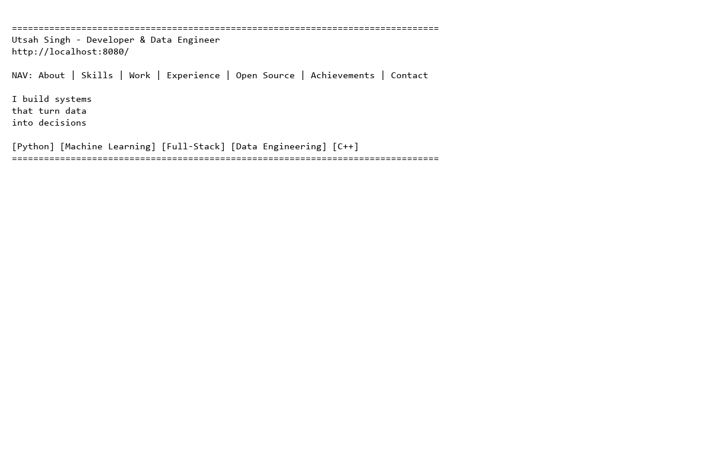

# 🚀 Utsah Singh - Personal Portfolio


A modern, fully containerized frontend portfolio application showcasing my projects, skills, and professional experience.

## ✨ Features

- **Interactive UI**: Engaging 3D hover effects on project cards.
- **Dynamic Content**: Typing animations in the hero section.
- **Live Integrations**: Real-time GitHub stats integration.
- **Responsive Design**: Fully optimized for mobile, tablet, and desktop viewing.
- **Dockerized**: Easily deployable anywhere using Docker and NGINX.

## 📂 Repository Structure

```text
├── assets/                 # Images and media assets
├── css/                    # Stylesheets
├── js/                     # JavaScript logic and animations
├── screenshots/            # Evidence of Docker execution
├── Dockerfile              # Docker NGINX configuration
├── .dockerignore           # Excluded files for Docker build
├── .gitignore              # Excluded files for Git
├── index.html              # Main HTML structure
└── README.md               # Project documentation
```

## 🛠️ Prerequisites

- [Docker](https://docs.docker.com/get-docker/) installed and running.
- [Git](https://git-scm.com/) installed (for cloning and version control).

## 🐳 Docker Instructions

### 1. Build the Docker Image

Run the following command in the project root to build the Docker image:

```bash
docker build -t utsah-portfolio .
```



### 2. Run the Container

Once built, start the container using the image. We map port `8080` on the host to port `80` inside the container.

```bash
docker run -d -p 8080:80 --name portfolio-container utsah-portfolio
```

Verify that the container is running:

```bash
docker ps
```



### 3. View the App

Open your browser and navigate to:
👉 [http://localhost:8080](http://localhost:8080)



## 💻 Local Run Steps (Without Docker)

If you prefer to run the application locally without Docker:
1. Clone the repository.
2. Open `index.html` in any modern web browser.
3. Alternatively, serve it using a local development server like VS Code Live Server or Python's `http.server`:
   ```bash
   python -m http.server 8000
   ```
   Then navigate to `http://localhost:8000`.

---
# BigData Notes – AWS Cloud Website Deployment

## Project Overview
This project demonstrates the deployment of a static website on AWS Cloud using Amazon S3 Static Website Hosting.

The website "BigData Notes" is designed using HTML, CSS, and JavaScript and is publicly accessible through a live AWS-hosted URL.

---

## Live Website Link
http://bigdata-notes.s3-website-us-east-1.amazonaws.com

---

## Technologies Used
- HTML5
- CSS3
- JavaScript
- AWS S3
- AWS Static Website Hosting

---

## AWS Services Used
- Amazon S3
- S3 Bucket Policy
- Static Website Hosting

---

## Features
- Responsive user interface
- Static website hosting on AWS
- Publicly accessible live website
- Cloud-based deployment

---

## Steps Performed

### 1. Created AWS Account
An AWS account was created and configured for cloud deployment.

### 2. Created S3 Bucket
An S3 bucket named:

bigdata-notes

was created in the region:

US East (N. Virginia) – us-east-1

### 3. Disabled Block Public Access
Public access settings were modified to allow website hosting.

### 4. Uploaded Website Files
The following files were uploaded to the S3 bucket:
- index.html
- style.css
- script.js
- images/

### 5. Enabled Static Website Hosting
Static website hosting was enabled from the bucket properties.

### 6. Added Bucket Policy
A bucket policy was configured to allow public read access.

### 7. Accessed Live Website
The website was successfully deployed and tested using the S3 website endpoint.

---

## Bucket Policy Used

```json
{
  "Version":"2012-10-17",
  "Statement":[
    {
      "Sid":"PublicReadGetObject",
      "Effect":"Allow",
      "Principal":"*",
      "Action":["s3:GetObject"],
      "Resource":["arn:aws:s3:::bigdata-notes/*"]
    }
  ]
}
*Built with ❤️ by Utsah Singh*
